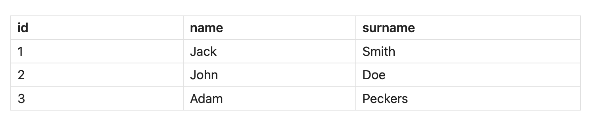
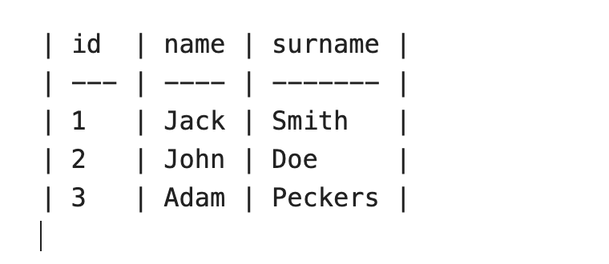
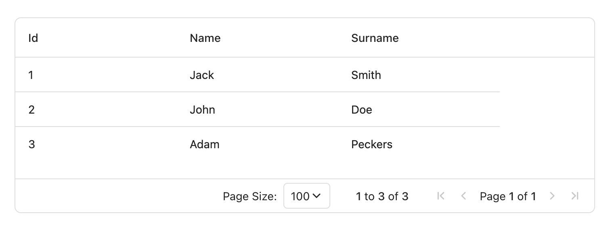
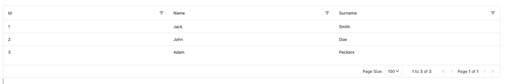

# Changing Render Method
SQLSeal allows for multiple render method to be used. By default it uses the Grid view (which is using AG Grid internally) to provide good looking, feature-rich grid display. You can customise how it is rendered as well as change the renderer all together.

## Table (HTML)
To display results as a regular HTML table you can add `HTML` above your `SELECT` query like following:
```sqlseal
TABLE data = file(./data.csv)

HTML
SELECT * FROM data
LIMIT 10
```




HTML render method does not come with any extra options (for now).

## Markdown
You can display table as a text based markdown table. This can be useful if you want to use SQLSeal output as a static table in your document or if you just prefer text look of the table.
To use Markdown renderer, put `MARKDOWN` above your `SELECT` query like:

```sqlseal
TABLE data = file(./data.csv)

MARKDOWN
SELECT * FROM data
LIMIT 10
```

Markdown renderer method does not come with any extra options (for now).




## Grid View Options

The default renderer is grid. You can force this view by putting `GRID` before your `SELECT` query (in the future SQLSeal will allow to change the default renderer globally). You can also use it to provide extra parameters (read more in Advanced Options section below).


```sqlseal
TABLE data = file(./data.csv)

GRID
SELECT * FROM data
LIMIT 10
```



### Advanced options

Grid renderer uses [AG Grid](https://www.ag-grid.com/) as a grid solution. You can pass options to it directly from your query to customise how it renders. Please note that configuration accepts only simple object and you cannot pass any functions or variables. For more information, see AG Grid documentation and examples below

#### Changing default column behaviour
To change behaviour of all columns, you can pass `defaultColDef` object. For more information, check [Column Definition documentation of AG Grid](https://www.ag-grid.com/javascript-data-grid/column-properties/).

```sqlseal
TABLE data = file(./data.csv)

GRID {
	defaultColDef: {
		filter: "agTextColumnFilter",
		flex: 1
	}
}
SELECT * FROM data
LIMIT 100
```

This adds text filtering options for each column and stretches them to the full width.


