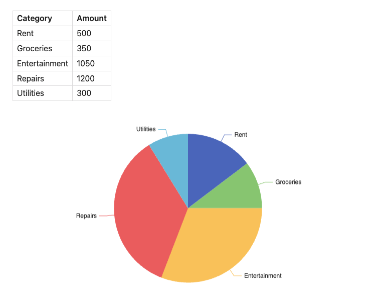

# Basics
Let's start with creating pie chart using data from our vault.
> [!NOTE] Note on data
> To make examples easier to reproduce, we will use markdown table located in the same file. In real vault you can use any data source like properties from your files, CSV data files, etc.


## Basic Piechart

| Category      | Amount |
| ------------- | ------ |
| Rent          | 500    |
| Groceries     | 350    |
| Entertainment | 1050   |
| Repairs       | 1200   |
| Utilities     | 300    |

```
TABLE finances = table(0)

CHART {
	series: [{
		type: 'pie'
	}]
}
SELECT * FROM finances
```



## Attribution and thanks
This project uses Apache ECharts under the hood. This is an amazing library with plenty of capabilities beyond the one presented in this documentation. Majority of functionality presented in their documentation should be also possible to achieve in SQLSeal Charts. For basic use-cases this documentation should be sufficient but if you're looking to dive deeper into advanced, interactive charts, [check out thier documentation too](https://echarts.apache.org/en/option.html).

## Contribute
If you implemented interesting chart or have an idea of visualising something but don't know how to approach it, [join our Discord and share your thoughts](https://discord.gg/ZMRnFeAWXb)!


## Syntax highlighting
> [!NOTE] Syntax Highlighting
> Syntax Highlighting for Charts works perfectly fine in Obsidian. It's not been yet implemented in this documentation