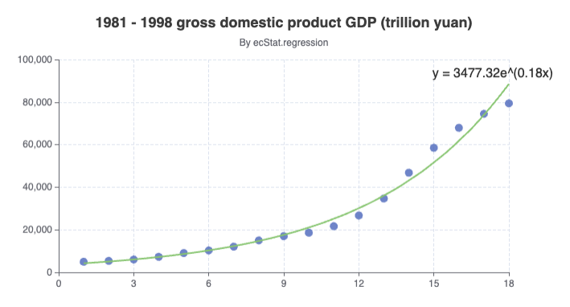

# Advanced: Regression
You can compute regression using SQLSeal Charts.

| x   | y       |
| --- | ------- |
| 1   | 4862.4  |
| 2   | 5294.7  |
| 3   | 5934.5  |
| 4   | 7171    |
| 5   | 8964.4  |
| 6   | 10202.2 |
| 7   | 11962.5 |
| 8   | 14928.3 |
| 9   | 16909.2 |
| 10  | 18547.9 |
| 11  | 21617.8 |
| 12  | 26638.1 |
| 13  | 34634.4 |
| 14  | 46759.4 |
| 15  | 58478.1 |
| 16  | 67884.6 |
| 17  | 74462.6 |
| 18  | 79395.7 |

```sqlseal
TABLE regression = table(0)
ADVANCED MODE
CHART
const dataArray = data.map(d => ([d.x, d.y]))

return {
  dataset: [
    {
	  id: 'data',
      source: dataArray
    },
    {
      transform: {
        type: 'ecStat:regression',
        config: {
          method: 'exponential'
          // 'end' by default
          // formulaOn: 'start'
        }
      }
    }
  ],
  title: {
    text: '1981 - 1998 gross domestic product GDP (trillion yuan)',
    subtext: 'By ecStat.regression',
    sublink: 'https://github.com/ecomfe/echarts-stat',
    left: 'center'
  },
  tooltip: {
    trigger: 'axis',
    axisPointer: {
      type: 'cross'
    }
  },
  xAxis: {
    splitLine: {
      lineStyle: {
        type: 'dashed'
      }
    }
  },
  yAxis: {
    splitLine: {
      lineStyle: {
        type: 'dashed'
      }
    }
  },
  series: [
    {
      name: 'scatter',
      type: 'scatter',
      datasetIndex: 0
    },
    {
      name: 'line',
      type: 'line',
      smooth: true,
      datasetIndex: 1,
      symbolSize: 0.1,
      symbol: 'circle',
      label: { show: true, fontSize: 16 },
      labelLayout: { dx: -20 },
      encode: { label: 2, tooltip: 1 }
    }
  ]
}
SELECT * FROM regression
```

