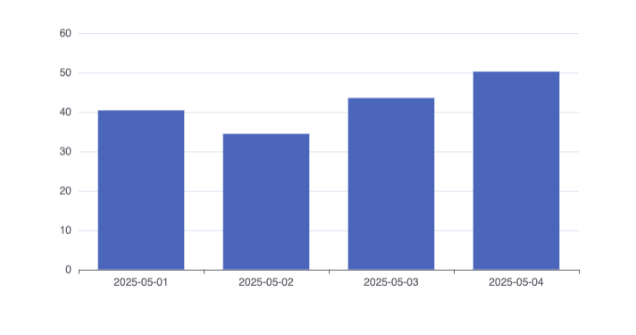
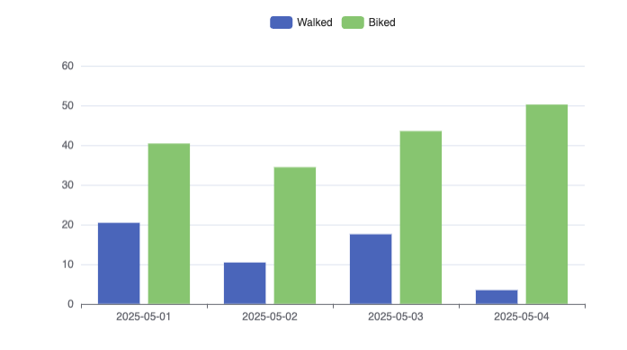

# Bar Chart
You can present your data as a Bar Chart

## Basic use

| Date       | Distance |
| ---------- | -------- |
| 2025-05-01 | 40.4     |
| 2025-05-02 | 34.43    |
| 2025-05-03 | 43.53    |
| 2025-05-04 | 50.23    |

```sqlseal
TABLE t = table(0)
CHART {
	xAxis: {
		type: 'category'
	},
	yAxis: {},
	series: [
		{ type: 'bar' }
	]
}
SELECT * FROM t
```



## Multiple series
You can show multiple series on the same chart. To do that you need to specify multiple series and define which column name corresponds to the `y` axis (values). We can also include interactive legend:


| Date       | Distance |
| ---------- | -------- |
| 2025-05-01 | 40.4     |
| 2025-05-02 | 34.43    |
| 2025-05-03 | 43.53    |
| 2025-05-04 | 50.23    |

```sqlseal
TABLE t = table(0)
CHART {
	xAxis: {
		type: 'category'
	},
	yAxis: {},
	legend: { show: true },
	series: [
		{
			type: 'bar', 
			encode: { y: 'walked' },
			name: 'Walked'
		},
		{
			type: 'bar', 
			encode: { y: 'biked' },
			name: 'Biked'
		}
	]
}
SELECT * FROM t
```

