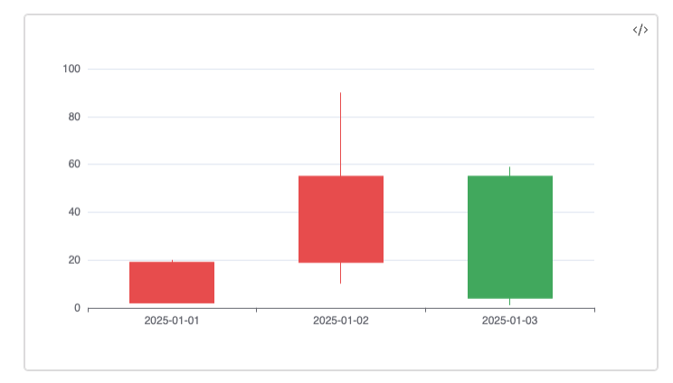

# Candlestick

# Basic

| date       | open | close | low | high |
| ---------- | ---- | ----- | --- | ---- |
| 2025-01-01 | 2    | 19    | 20  | 5    |
| 2025-01-02 | 19   | 55    | 10  | 90   |
| 2025-01-03 | 55   | 4     | 1   | 59   |

```sqlseal
TABLE t = table(0)

CHART {
	xAxis: { type: 'category' },
	yAxis: { },
	series: [
	{
		type: 'candlestick',
	}
	]
}
SELECT * FROM t
```

