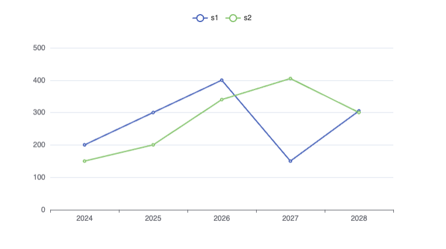

# Line Chart
You can present your data as a linechart:


| Date | s1  | s2  |
| ---- | --- | --- |
| 2024 | 200 | 150 |
| 2025 | 300 | 200 |
| 2026 | 400 | 340 |
| 2027 | 150 | 405 |
| 2028 | 305 | 300 |

```sqlseal
TABLE data = table(0)
CHART 
{
	xAxis: { type: 'category' },
	yAxis: { },
    legend: { show: true }, 
	series: [{ type: 'line' }, { type: 'line' }]
}
SELECT * FROM data
```
