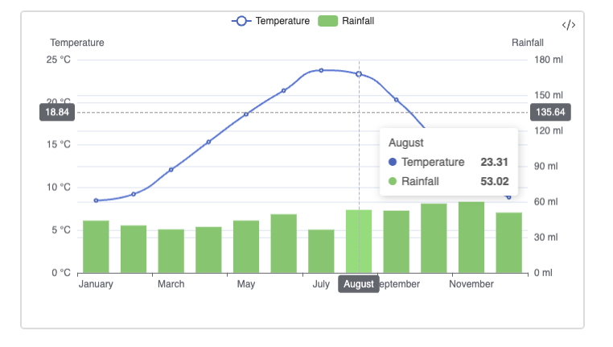

# Mixed Charts
You can mix and match charts together. If both chart types are drawn on the XY axis, you can display different dataseries next to each other.

## Basic Example
Below we display precipitation (as bar chart) and temperature (as a line chart) together. We also add interactive crosshair to inspect data in more details:


| Month     | max_temp | min_temp | Sunshine | Rainfall |
| --------- | -------- | -------- | -------- | -------- |
| January   | 8.47     | 3.36     | 44.42    | 43.93    |
| February  | 9.21     | 3.22     | 66.11    | 39.85    |
| March     | 12.07    | 4.66     | 109.71   | 36.52    |
| April     | 15.35    | 6.02     | 152.85   | 38.63    |
| May       | 18.59    | 9.06     | 198.68   | 43.99    |
| June      | 21.37    | 12.04    | 198.55   | 49.34    |
| July      | 23.75    | 13.93    | 209.24   | 36.30    |
| August    | 23.31    | 14.08    | 198.02   | 53.02    |
| September | 20.29    | 11.57    | 140.58   | 52.38    |
| October   | 15.83    | 8.99     | 99.66    | 58.34    |
| November  | 11.55    | 6.09     | 58.50    | 59.85    |
| December  | 8.85     | 3.77     | 50.09    | 50.71    |

Source: [Met Office](https://www.metoffice.gov.uk/research/climate/maps-and-data/location-specific-long-term-averages/gcpuzgp72). London, Greenwich avg for 1991-2020. Temperatures in °C, rainfall in mm. sunshine in hours.

```sqlseal
TABLE t = table(0)

CHART {
	xAxis: { type: 'category' },
	yAxis: [
		{
	      type: 'value',
	      name: 'Temperature',
	      min: 0,
	      max: 25,
	      position: 'left',
	      axisLabel: {
	        formatter: '{value} °C'
	      }
	    },
	    {
		    type: 'value',
		      name: 'Rainfall',
		      min: 0,
		      max: 180,
		      position: 'right',
		      axisLabel: {
		        formatter: '{value} mm'
		      }
	    }
	],
	series: [
		{
	      name: 'Temperature',
	      type: 'line',
	      smooth: true,
	      yAxisIndex: 0,
	    },
	    {
	      name: 'Rainfall',
	      type: 'bar',
	      yAxisIndex: 1,
	      encode: { y: 'rainfall' },
      }
	    
	],
	tooltip: {
	    trigger: 'axis',
	    axisPointer: { type: 'cross' }
  },
  legend: {},
}
SELECT month, max_temp, rainfall FROM t
```

