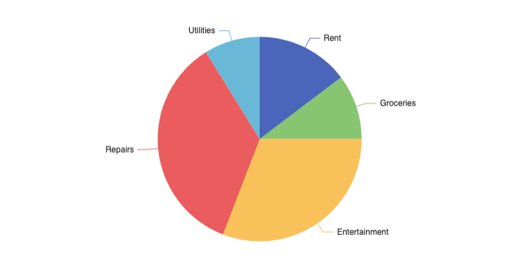
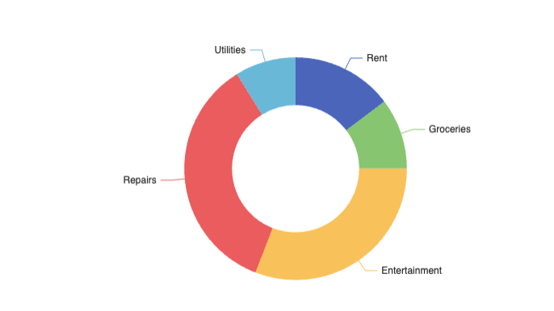
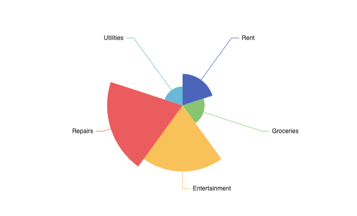

# Pie Chart
You can use pie chart to show how certain data splits into different buckets

## Basic

| Category      | Amount |
| ------------- | ------ |
| Rent          | 500    |
| Groceries     | 350    |
| Entertainment | 1050   |
| Repairs       | 1200   |
| Utilities     | 300    |
```sqlseal
TABLE finances = table(0)

CHART {
	series: [{
		type: 'pie'
	}]
}
SELECT * FROM finances
```



## Ring Style (Doughnut)
You can make doughnut style charts (remove the middle) by specifying inner and outer radii:

```sqlseal
TABLE finances = table(0)

CHART {
	series: [{
		type: 'pie',
        radius: ['40%', '70%']
	}]
}
SELECT * FROM finances
```



## Nightingale Chart (Rose Chart)
You can present your data as a Nightingale chart. You can achieve them by adding `roseType: 'area'`:


```sqlseal
TABLE finances = table(0)

CHART {
	series: [{
		type: 'pie',
        roseType: 'area'
	}]
}
SELECT * FROM finances
```

