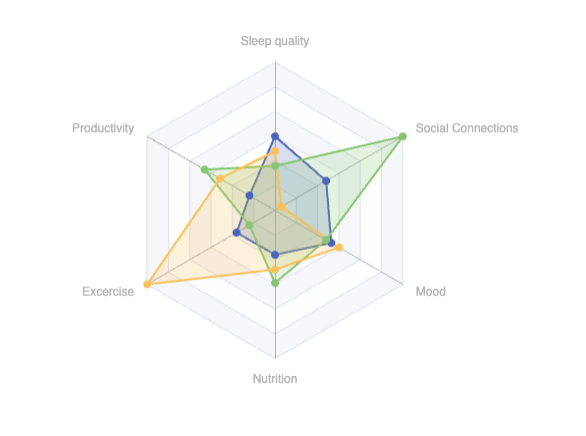

# Radar
Radar chart allows to show related data as a polygon spanning on the radar. You can use multiple datapoints to compare different values.

# Example
Below is the example of tracking your daily routines accross multiple days:


| Sleepquality | Productivity | Exercise | Nutrition | Mood | Socialconnection |
| ------------ | ------------ | -------- | --------- | ---- | ---------------- |
| 50           | 20           | 30       | 30        | 44   | 40               |
| 30           | 55           | 20       | 49        | 40   | 100              |
| 40           | 43           | 100      | 40        | 50   | 5                |


```sqlseal
TABLE data = table(0)
CHART {
  radar: {
    indicator: [
		{ name: 'Sleep quality', max: 100 },
		{ name: 'Productivity', max: 100 },
		{ name: 'Excercise', max: 100 },
		{ name: 'Nutrition', max: 100 },
		{ name: 'Mood', max: 100 },
		{ name: 'Social Connections', max: 100 },
    ],
    shape: 'polygon',
    splitNumber: 6,
    },
    series: [{
		type: 'radar',
		areaStyle: { opacity: 0.2 }
    }]
}
SELECT * FROM data
```

