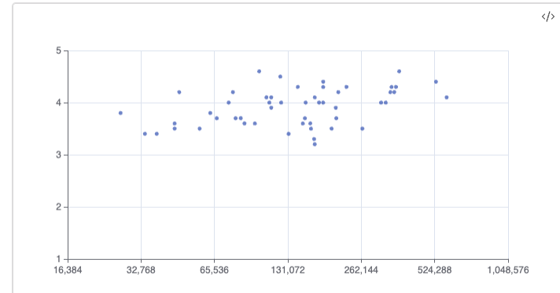

# Scatter Plot
You can use scatterplot

## Basics
Example below renders scatterplot comparing book wordcount and it's rating. It also adds interactive labels on hover so you know which book title point corresponds to.
We also set minimum for y axis to 1 (as this is minimal rating book can get) and x axis to log2 scale.

| Title                              | Wordcount | Rating |
| ---------------------------------- | --------- | ------ |
| War and Peace                      | 587000    | 4.1    |
| Don Quixote                        | 345000    | 4.2    |
| Les Misérables                     | 531000    | 4.4    |
| The Count of Monte Cristo          | 375000    | 4.6    |
| Anna Karenina                      | 349000    | 4.3    |
| Crime and Punishment               | 211000    | 4.2    |
| Pride and Prejudice                | 122000    | 4.5    |
| Moby Dick                          | 206000    | 3.9    |
| Great Expectations                 | 183000    | 4.0    |
| Jane Eyre                          | 183000    | 4.4    |
| The Brothers Karamazov             | 364000    | 4.3    |
| Middlemarch                        | 316000    | 4.0    |
| The Great Gatsby                   | 47000     | 4.2    |
| Wuthering Heights                  | 107000    | 4.1    |
| One Hundred Years of Solitude      | 144000    | 4.3    |
| To Kill a Mockingbird              | 100000    | 4.6    |
| The Odyssey                        | 123000    | 4.0    |
| The Divine Comedy                  | 112000    | 4.1    |
| The Picture of Dorian Gray         | 78000     | 4.2    |

```sqlseal
TABLE d = table(0)
CHART {
	xAxis: {
		type: 'log',
		logBase: '2'
	},
	yAxis: {
		min: 1
	},
	tooltip: { },
	series: [{
		type: 'scatter',
		symbolSize: 5,
		encode: {
			x: 'wordcount',
			y: 'rating',
			tooltip: 'title'
		}
	}]
}
SELECT * FROM d
```



> [!NOTE] Advanced Functionality
> With scatter plot you can perform even more advanced functionality like drawing regression line or running clustering algorithms. Check out advanced section of the documentation for more details on that.