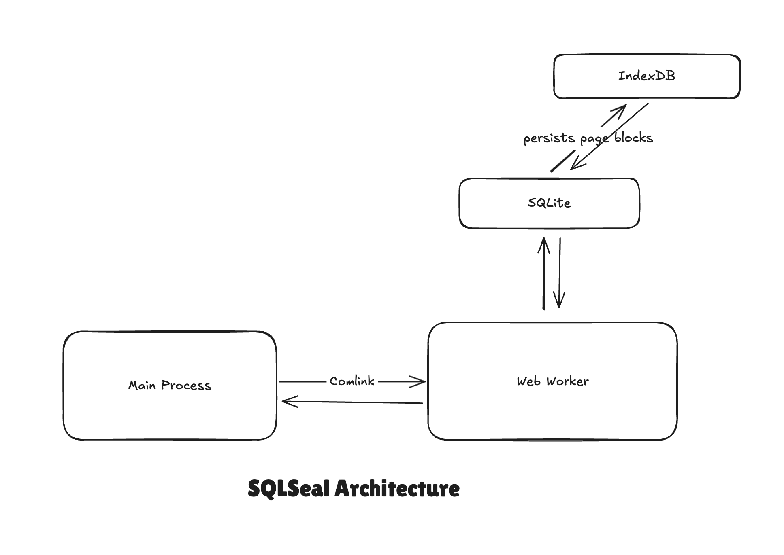

# Project Architecture
SQLSeal is an Obsidian Plugin written in TypeScript. We use the following tech stack:
- [PNPM](https://pnpm.io/)
- [TypeScript](https://www.typescriptlang.org/)
- [SQL.JS](https://github.com/sql-js/sql.js): [SQLite](https://www.sqlite.org/) compiled into WebAssembly
    - [AbsurdSQL](https://github.com/jlongster/absurd-sql) to persist SQLite page blocks into IndexedDB and not keep the database in the memory
- [AGGrid](https://www.ag-grid.com/) - grid solution, default table renderer
- Node-SQL-Parser - to parse SQL and modify table names before sending it to SQLite
- Comlink - for Webworker communication abstraction

## Architecture overview

On the high level SQLSeal uses SQLite and communicates with it using WebWorker. The main process calls that Web Worker (using Comlink as a wrapper to abstract away complexity of postMessage and wrap it into class methods returning promises instead). The database is setup in a way that individual blocks are being persisted into the IndexedDB. Thanks to that even if the database grows, the memory footprint should stay relatively low.

## Extensible Architecture
The plugin is designed with extensible architecture in mind. I want to encourage people to write related plugins that expand functionality of SQLSeal or use it as the storage. Below I describe my plans. Some interfaces are already in place, some will be implemented at the later stage.

### Adding new Renderers
> [!NOTE] Stage
> Current Stage: Proof of Concept

SQLSeal by default gets 3 renderers (or views) bundled in: GRID (default), HTML and MARKDOWN. I want the plugin to reach the stage where external plugins can register their own renderers with thier own configuration and control how the query result is being displayed. I work on a SQLSeal Plot (codename) that allows you to chart results of your query. Once it's finished documentation and interface for this feature can be finalised.

### Register new data source
> [!NOTE] Stage
> Current Stage: Idea

I want to allow external plugins to register their data sources: i.e. plugin that fetches your IMDB watch history and creates new table. To allow full data ownership, the plugin would save the results on the disk (probably as CSV) so user can later use the data however they want.

### Register new data types
> [!NOTE] Stage
> Current Stage: Idea

### Expose SQLSeal interface to other plugins
> [!NOTE] Stage
> Current Stage: Development

Other plugins could extend SQLSeal's TABLE syntax so it can operate on more data types (i.e. JSON, XLSX).