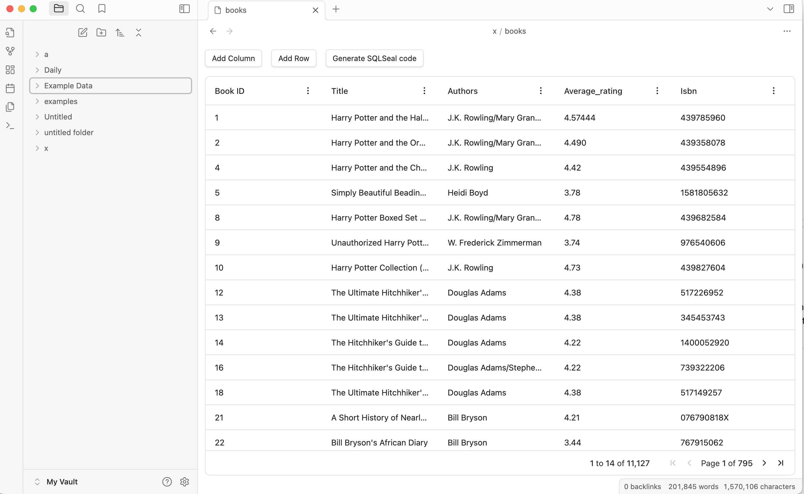
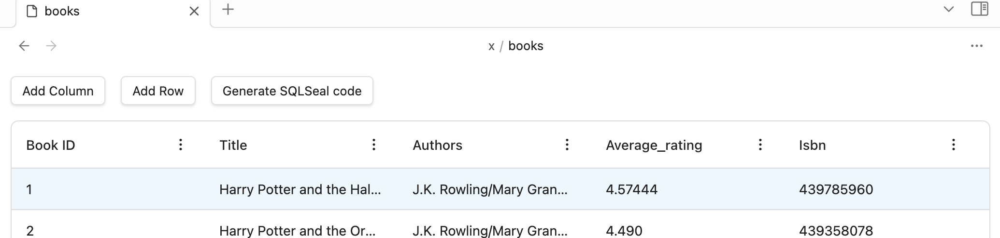
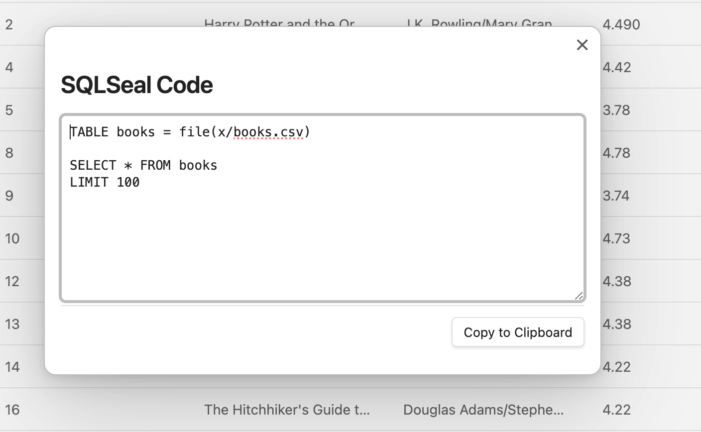

# CSV Viewer
SQLSeal comes with included CSV Viewer (and editor) starting at version 0.11. The Viewer is enabled by default and can be configured using SQLSeal settings.

## Viewing the file
When CSV viewer is enabled, all the CSV files in your vault will be displayed in your Files view. They will also become searchable in the Quick Command (cmd+o).

## Editing CSV files
When editing is enabled you can:
- Add new columns
- Add new rows
- Delete Columns
- Delete Rows
- Edit individual cells / values

> [!CAUTION]
> Editing CSV files might cause data loss! Make sure to always backup your files before proceeding.

### Adding rows and columns
To add and row or a column, click appropriate button above your table.

### Deleting Columns
To delete a column, click the menu next to it and choose Remove Column. You will be asked to confirm your action. This will remove column and all the data assigned to this column from each individual row.

### Deleting Row
To delete a row, right click on a row and choose "Delete Row". You will be asked to confirm your action.

### Editing values
To edit specific value, double click onto the cell and start typing new value.

## Generating SQLSeal code
You can generate SQLSeal code from this view to speed up your process. It will fill in the file location and name the table based on the CSV file name.

