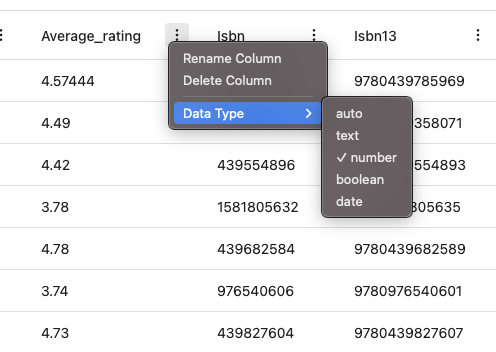

# Define Column Types (CSV files)

SQLSeal sets types of your data automatically. This is the mechanism which for most of the cases works perfectly, but for more advanced use-cases, you might want to force specific type of the column (for example you might have ids which you want to treat like text, even if they consist of just the numbers). To enforce a specific type, you can set individual types inside the CSV Viewer:

Changing data type enables corresponding controls.