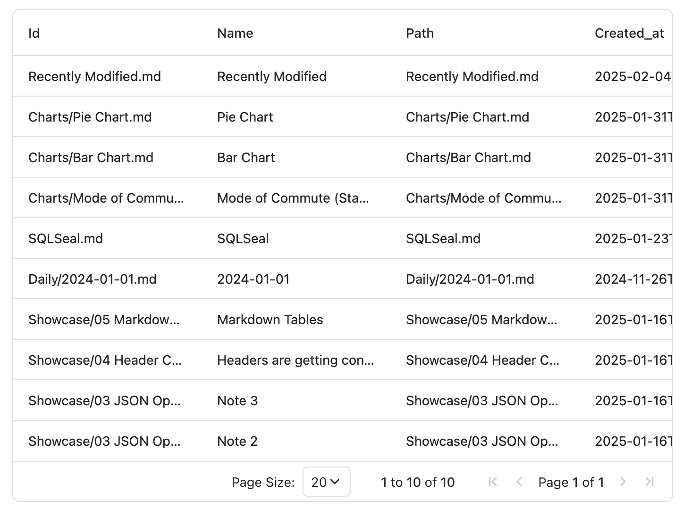
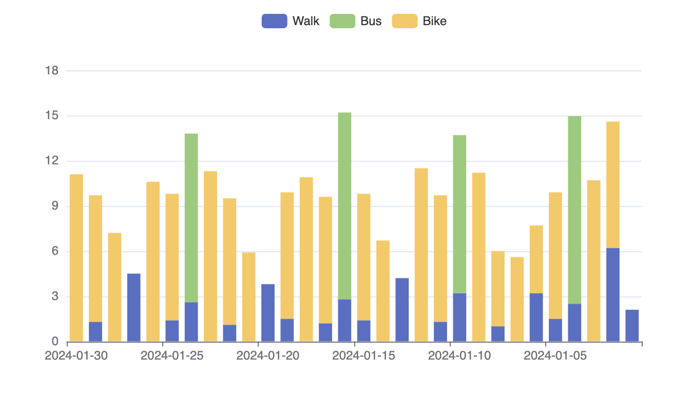

---
# https://vitepress.dev/reference/default-theme-home-page
layout: home

hero:
  name: "Obsidian SQLSeal"
  # text: "Plugin enabling full SQL capabilities in Obsidian"
  tagline: "Query your vault using SQL"
  image:
    src: /logo.svg
    alt: SQLSeal
  actions:
    - theme: brand
      text: Get Started
      link: /quick-start

# features:
#   - title: Query data in your vault
#     details: Use full power of SQL to select, join, filter data for your liking
#   - title: Fully featured SQL Engine
#     details: With SQLite under the hood, you can use all functionality of the database
#   - title: Query your files and tags
#     details: Use SQL to filter files in your vault
#   - title: Add your own data
#     details: Operate on your CSV files using SQL to process them on the go
---
<div class="vp-doc">
  <div class="container-split">
    <div class="content">
Turn your Obsidian vault into a powerful, queryable database using SQL. SQLSeal seamlessly integrates with your notes and CSV and JSON files, enabling you to extract insights and patterns from your personal knowledge base.

```sql
SELECT * FROM files
ORDER BY modified_at DESC
LIMIT 10
```

</div>
    <div class="image">



</div>
  </div>
</div>

<div class="vp-doc">
  <div class="container">
    <div class="features">
      <div class="feature">
        <h3>🔍 SQL Powered</h3>
        <p>Query your notes and data using familiar SQL syntax. Perfect for both SQL experts and beginners.</p>
      </div>
      <div class="feature">
        <h3>📊 CSV and JSON Integration</h3>
        <p>Seamlessly work with CSV and JSON files in your vault. Preview, query, and even edit them directly in Obsidian.</p>
      </div>
      <div class="feature">
        <h3>📱 Cross-Platform</h3>
        <p>Works on both desktop and mobile devices. Your data insights everywhere you go.</p>
      </div>
    </div>
  </div>
</div>


<div class="vp-doc">
  <div class="container-split">
    <div class="content">

## Query any data
You can query any CSV and JSON data stored in your vault. SQLSeal can help you analyse your finances, workouts, goals and whatever you imagine!

```sql
TABLE commute = file(transport.csv)

SELECT
	Date,
	transport_type,
	SUM(distance_km) AS total_distance,
	group_concat(purpose) as purposes
FROM commute
WHERE date = @date
GROUP BY Date, Transport_Type
```

</div>
    <div class="image">

| date       | transport_type | total_distance | purposes      |
| ---------- | -------------- | -------------- | ------------- |
| 2024-01-02 | bike           | 8.4            | commute       |
| 2024-01-02 | walk           | 6.2            | lunch,leisure |

</div>
  </div>
</div>


<div class="vp-doc">
  <div class="container-split reverse">

<div class="content">

## Visualise
Take your analysis to the next level with SQLSeal Charts that expands the plugin with full visualisation tool.

::: tip Coming Soon
SQLSeal Charts is currently being reviewed by Obsidian. As soon as it gets approved, full documentation will be released.
:::

</div>
<div class="image">



</div>
</div>
</div>


<Stats />


<style>
.container {
  margin: 2rem 0;
}

.features {
  display: grid;
  grid-template-columns: repeat(auto-fit, minmax(250px, 1fr));
  gap: 1rem;
}

.feature {
  padding: 1.5rem;
  border-radius: 8px;
  background-color: var(--vp-c-bg-soft);
}

.container-split {
  display: grid;
  grid-template-columns: 1fr 1fr;
  gap: 2rem;
  align-items: center;
  margin: 2rem 0;
}

.container-split.reverse > div:first-child {
  order: 2;
}

.image img {
  max-width: 100%;
  border-radius: 8px;
}

@media (max-width: 768px) {
  .container-split {
    grid-template-columns: 1fr;
  }
  .container-split.reverse > div:first-child {
    order: -1;
  }
}
</style>