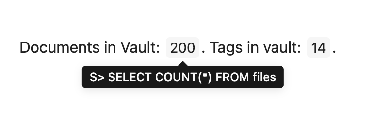

# Inline Codeblocks
SQLSeal supports inline codeblocks. This allows you to put data inline with your text so you can use results of your queries as part of the sentence.

## Creating inline block
Inline block should start with `S>` to indicate you want to create SQLSeal query. Then it should contain SQL query returning single value.

## Example queries

Here are example queries operating on files in your vault:

### Number of files in your vault
`S> SELECT COUNT(*) FROM files`

### Number of tags in your vault
`S> SELECT COUNT(DISTINCT tag) FROM tags`

### Completed tasks accross your vault
`S> SELECT COUNT(*) FROM tasks WHERE completed=1`