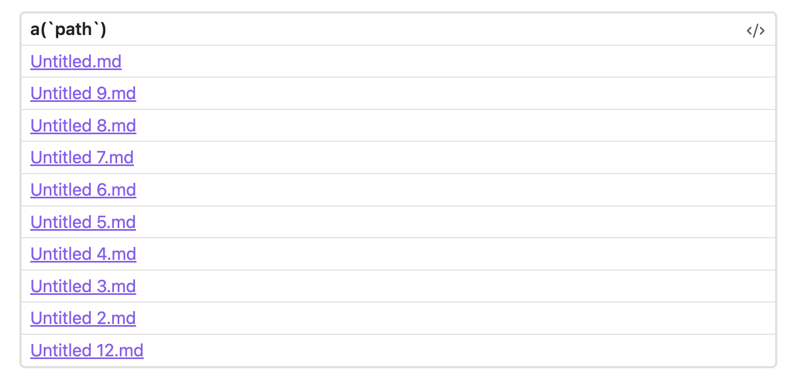
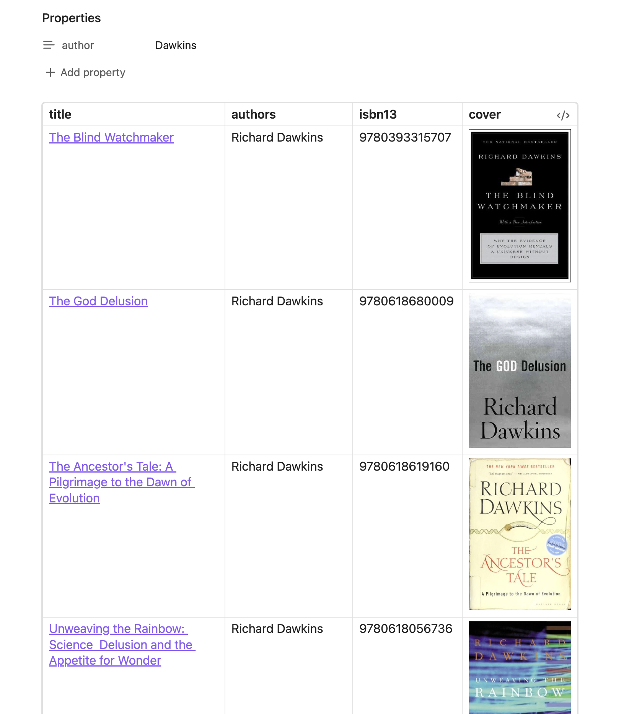

# Links and Images
Introduced in version 0.8. Make sure you are using up to date version.

SQLSeal allows for rendering links and images. For now the images needs to be external ones (no support for stored images for now but should be added in the future releases).

## Links
To display a link, wrap use the `a` SQL function, for example:
```sql
SELECT a(path) FROM files LIMIT 10
```


You can use second parameter to provide name for the link:

```sql
SELECT a(path, name) from files LIMIT 10
```


This API works for both filesystem and CSV files.

## Images
You can embed images within your results. You need to wrap your resulting column with `img` function.

```sql
SELECT name, img(coverImg) FROM files
```

### Local images
When using local images (stored in Obsidian) you need to pass second parameter being path of the original note. For example:

```sql
SELECT path, img(cover, path) FROM files
```

## Advanced Examples
The example below uses [Goodreads-books](https://www.kaggle.com/datasets/jealousleopard/goodreadsbooks) Kaggle dataset in CSV loaded in obsidian to display books with links to Open Library and showing the covers from Open Library Cover API. It uses Obsidian property to filter the author name.


```sql
TABLE books = file(books.csv)

SELECT
a('https://openlibrary.org/isbn/' || isbn13, title) as title,
authors,
isbn13,
img('https://covers.openlibrary.org/b/isbn/' || isbn13 || '-L.jpg') as cover
from books
WHERE authors LIKE concat('%', @author, '%')
LIMIT 10
```



## Checkboxes
You can display boolean data as checkbox in the interface by calling `checkbox` function:
```sql
SELECT date, checkbox(excercised) FROM files WHERE date is not null
```