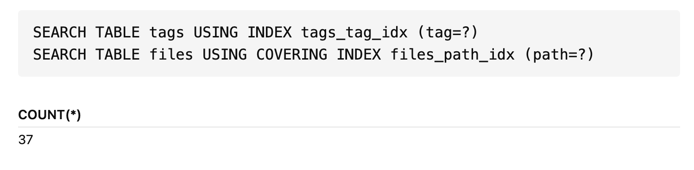

# Query Configuration
You can specify the following configuration to change behaviour of your query.

Configuration statements go always after all `TABLE` statements and before view / renderer definition or SELECT definition.

Example:
```sqlseal
TABLE data = file(data.csv)

REFRESH
EXPLAIN

GRID
SELECT * FROM data
```

## Refresh
You can use `REFRESH / NO REFRESH` to change default refreshing behaviour.
When you set `NO REFRESH`, the query will execute once and will not listen to any changes to the underlying data. This is especially helpful if you run very expensive query and want to have full control on when it refreshes.

`REFRESH` will refresh the query every time the underlying data changes. It listens only to the tables you actually use in the query.


## Explain
You can use `EXPLAIN` statment to show execution plan of the query. This is helpful when you want to analyse the queries performed to optimise them or see where are bottlenecks.
For majority of the queries explain might be very simple but your more advanced it can bring some insights:

